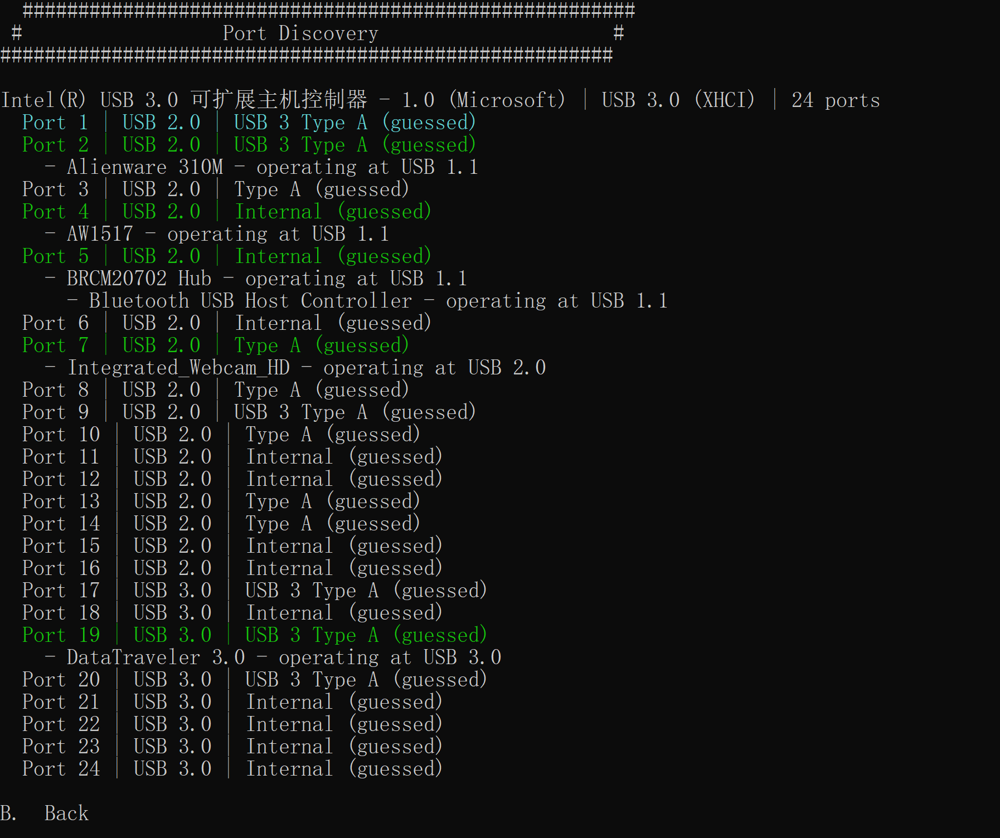

# 解决USB端口映射

本文依旧不限于Windows和macOS，但Windows可能更加方便

## 准备软件

前往[这里](https://github.com/USBToolBox/tool)，在发布页面下载符合你系统的二进制文件，例如Windows则下载Windows.exe。

随后安装好Python3，以便不时之需。

## 开始操作

### 制作kext

你应当首先至少插入一个usb设备（在Windows上），在macOS上则要各插入一个usb2.0和usb3.0设备，随后打开软件：

.png>)

可以看到，因为打开过一次，所以多出第一个选项：删除保存的USB数据，第一次打开并没有这个选项，随后摁下D并回车，来查找你的Usb端口

如图，我有24个端口，而实际上我只能在macOS中加载15个，所以我们摁下B，回车回到主界面，再摁下S并回车进入：

.png>)

这里按照需要进行选择，输入序号即可启用，比如我想启用第三个端口，那么输入3即可，建议先输入P再选择其他的端口，保证基本的usb设备的使用，选择结束后，输入K，回车，会在软件目录生成kext。

### 下载依赖并修改配置文件

从[这里](https://github.com/USBToolBox/kext)下载最新的UsbToolBox，并加载在上面生成的kext前，否则会出错。

最终效果：

.png>)
